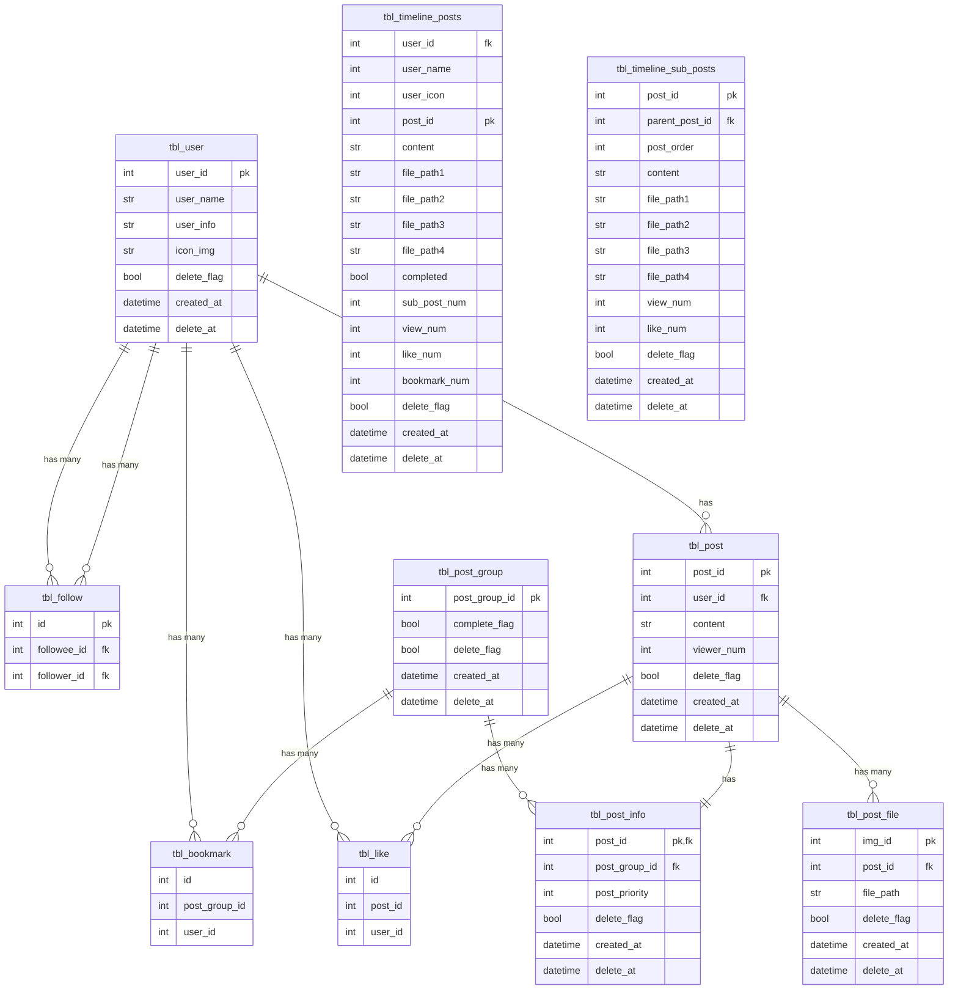

# sv

Everything you need to build a Svelte project, powered by [`sv`](https://github.com/sveltejs/cli).

## Creating a project

If you're seeing this, you've probably already done this step. Congrats!

```bash
# create a new project in the current directory
npx sv create

# create a new project in my-app
npx sv create my-app
```

## Developing

Once you've created a project and installed dependencies with `npm install` (or `pnpm install` or `yarn`), start a development server:

```bash
npm run dev

# or start the server and open the app in a new browser tab
npm run dev -- --open
```

## Building

To create a production version of your app:

```bash
npm run build
```

You can preview the production build with `npm run preview`.

> To deploy your app, you may need to install an [adapter](https://svelte.dev/docs/kit/adapters) for your target environment.


# glowG クリエイター向け進捗投稿SNS - 要件定義書

## 📌 概要

イラストレーター・ゲーム制作者・デザイナーなど、創作活動を行うクリエイターが進捗状況を気軽に投稿・共有できるSNSサービス。  
製作途中をAI学習される恐れがあるため、その対策には特に重点を置く


ph0.1: 最小構成で個人開発を進行する。

---

## 🎯 ターゲット

- 個人で活動するイラストレーター・ゲームクリエイター・漫画家・VTuberなど
- 制作途中のアウトプットを気軽に発信したいが、AI学習の懸念がある人
- Pixiv・Twitterではフォロワーとの距離や作品の重さがネックな人

---

## 🛠 技術スタック（プロトタイプ段階）

| 項目         | 技術構成                     |
|--------------|------------------------------|
| フロントエンド | SvelteKit                    |
| 認証         | Supabase Auth                |
| データベース | Supabase PostgreSQL          |
| ストレージ   | Supabase Storage             |
| デプロイ     | Vercel または Netlify        |

---

## 📦 基本機能一覧（MVP）

### ユーザー関連
- [x] サインアップ／ログイン（メール／SNS連携）
- [ ] 匿名アカウント作成（検討）
- [x] プロフィール設定（名前・自己紹介・アイコン）

### 投稿機能
- [x] 投稿作成（テキスト＋画像1枚）
- [x] 進捗ステータス（構想中／制作中／完成 など）
- [x] タグ付け（例：#背景 #キャラデザ）
- [x] AI学習拒否フラグ（明示オプション）
- [ ] 投稿編集／削除機能

### タイムライン
- [x] 全体タイムライン
- [ ] フォロー機能（要検討）
- [x] 自分の投稿一覧（マイページ）

### ストレージ関連
- [x] 画像アップロード（1投稿につき最大1枚）
- [x] Supabase Storage URLによる参照

### その他
- [x] RLS（Row Level Security）で投稿の所有者制御
- [ ] ダークモード対応（将来的に）

---

## 🧠 AI学習対策ポリシー（初期）

- 投稿時に「AI学習に使用しないでください」設定可能
- HTML内に `<meta name="robots" content="noai, noimageai">` を付与
- サーバーサイドで画像ファイルのメタデータに「学習不可」情報付加（将来的に）

---

## 📐 画面構成（ページ構造）

/
├── 投稿一覧（トップページ）
├── /login : ログイン画面
├── /post : 投稿作成ページ
├── /profile/[id] : プロフィール（自分／他人）

yaml
コピーする
編集する

---

## 💸 コスト見積り（目安）

| 項目        | 想定プラン         | 月額費用（USD）  |
|-------------|--------------------|------------------|
| Supabase    | Free〜Pro ($0〜25) | 投稿数に応じて拡張可能 |
| ドメイン    | お名前.comなど     | 約1000円/年       |
| Vercel/Netlify | 無料プランで十分   | $0               |

---

## 🔐 セキュリティ・運用想定

- 投稿にはすべて認証を必須化（SupabaseのRLSで制御）
- 不適切投稿は通報機能 or 後日運用で対応（初期は未実装）
- 利用規約とプライバシーポリシーは最低限でスタート

---

## ⏳ 今後の拡張案

- コメント／リアクション機能
- 通知（誰かがフォロー or コメント）
- フォロー・ミュート機能
- 投稿の進捗履歴（アップデート型）
- 有料投稿・サブスクリプション（クリエイター支援）

---

## 📅 開発フェーズ（初期スケジュール例）

| フェーズ       | 期間       | 内容                               |
|----------------|------------|------------------------------------|
| 設計 & 構築     | Day 1〜7   | DB設計・認証連携・投稿フォーム作成 |
| 基本機能実装    | Day 8〜14  | 投稿一覧表示・プロフィール画面     |
| 公開準備 & デプロイ | Day 15〜17 | デプロイ・規約・LP追加               |
| MVP公開        | Day 18〜20 | SNSやDiscordでテストユーザー募集    |

---

## 📝 使用予定ライブラリ・ツール（補足）

- `@supabase/supabase-js`：API通信
- `@tailwindcss`：スタイリング
- `sveltekit-superforms`（任意）：フォームバリデーション簡略化
- `uuid`：投稿ID生成（Supabaseでも可）

---

## API
論理名|物理名|メソッド|対象DB|処理概要
-|-|-|-|-
ポスト概要取得API | a | GET | 全てのテーブル | ポストの先頭要素を最新順に100件ほど取得する
ポスト詳細取得API | a | GET | tbl_user, tbl_bookmark 以外 | 1つのポストグループについて詳細情報をすべて取得する
ポスト新規投稿API | a | POST | tbl_post, tbl_post_group, tbl_post_info, tbl_post_img | ポストグループを新たに作成する
ポスト追加投稿API | a | POST | tbl_post, tbl_post_group, tbl_post_info, tbl_post_img | 既存のポストグループに投稿を追加する
ポストクローズAPI | a | POST | tbl_post_group | ポストグループを完了にする
ブックマークAPI | a | POST | tbl_bookmark | ポストグループに対してブクマする
いいねAPI | a | POST | tbl_like | ポストに対していいねする
フォローAPI | a | POST | tbl_follow | ユーザをフォローする
ユーザ詳細取得API | | GET | | ユーザ情報、過去投稿、ブクマしている投稿を取得する

## ER図


